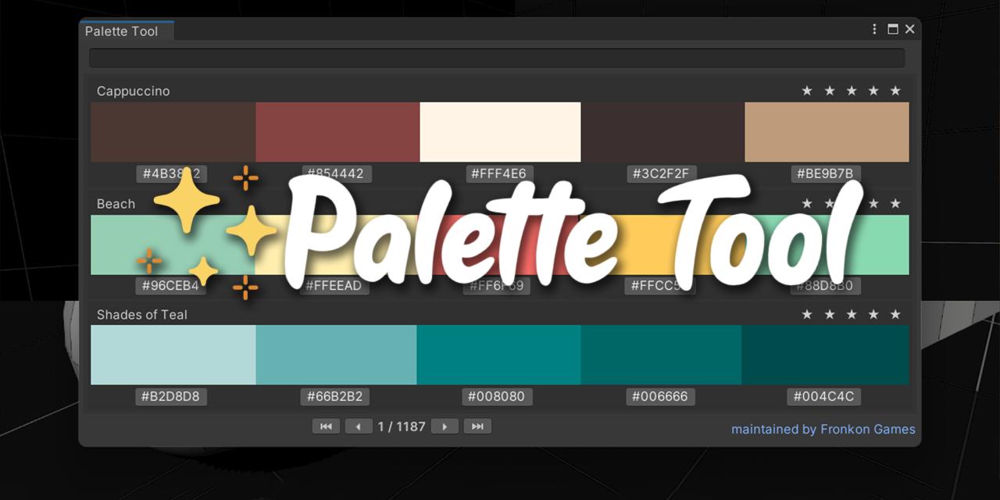

 

    
  
  

A color palette tool for Unity that helps artists and developers search color in the Editor.

## ✨ Features

- More than 6000 palettes from [color-hex.com](https://www.color-hex.com/)
- Search colors by name, or tags
- Click to copy color codes to clipboard

## 🚀 Installation

### Option 1: Unity Package Manager (Recommended)

1. Open the Package Manager window in Unity (Window > Package Manager)
2. Click the "+" button and select "Add package from git URL..."
3. Enter: `https://github.com/FronkonGames/Palette-Tool.git`
4. Click "Add"

### Option 2: Manual Installation

1. Download the latest release from the [Releases](https://github.com/FronkonGames/Palette-Tool/releases) page
2. Extract the contents into your Unity project's Assets folder

## 🔧 Usage

1. Open the Palette Tool window by navigating to **Help > Tools > Fronkon Games > Palette Tool**
2. Browse, and search your colors

## 📜 License

Code released under [MIT License](https://github.com/FronkonGames/Palette-Tool/blob/main/LICENSE.md).